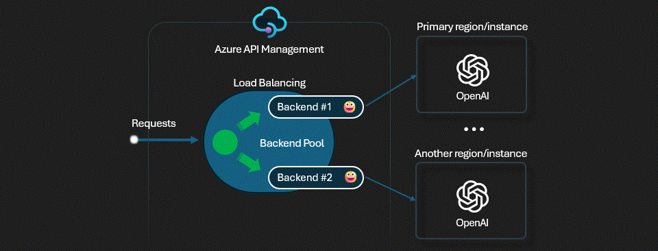
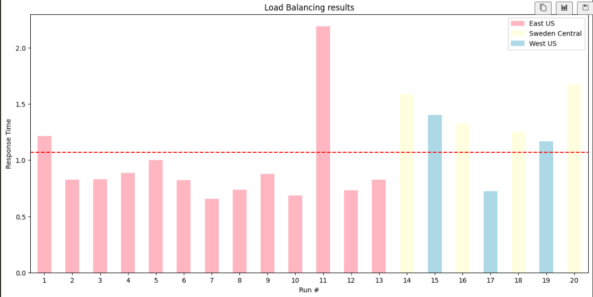
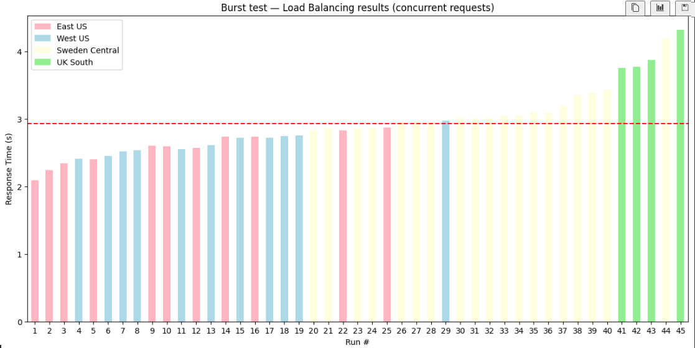

# AI Gateway Implementations

This repository contains multiple implementation tracks for Azure AI Gateway scenarios.

## Implementations

### 1. Backend Pool Load Balancing — APIM + Azure AI Foundry

Priority-based routing across four Azure AI Foundry endpoints with transparent failover via APIM's built-in backend pool feature.

- **Guide:** [ai-gateway-backend-pool-load-balancing.md](ai-gateway-backend-pool-load-balancing.md)
- **Source lab:** [Azure-Samples/AI-Gateway — backend-pool-load-balancing](https://github.com/Azure-Samples/AI-Gateway/blob/main/labs/backend-pool-load-balancing/backend-pool-load-balancing.ipynb)

| Decision | Value |
|----------|-------|
| APIM tier | Basicv2 |
| Backends | East US (priority 1) + Sweden Central & West US (priority 2, 50/50) + UK South (priority 3) |
| Model | `gpt-4o-mini` |
| Load balancing | Priority-based with weighted failover |
| Auth | APIM managed identity → Cognitive Services OpenAI User |

## Details

### APIM Tiers

Azure API Management is available across several tiers — **Developer**, **Basic**, **Basicv2**, **Standard**, **Standardv2**, **Premium**, and **Consumption** — each offering a different balance of features, scalability, and cost. The classic tiers (Developer through Premium) provide a full-featured gateway with VNet integration, multi-region deployments, and built-in cache, while the v2 tiers (Basicv2, Standardv2) are a modernized offering with faster provisioning and scaling. The Consumption tier is fully serverless and billed per call, making it ideal for low-traffic or dev/test scenarios. Higher tiers unlock advanced capabilities such as availability zones, custom domains per gateway, and dedicated capacity.

For a full feature comparison, see the [Azure API Management tier features](https://learn.microsoft.com/en-us/azure/api-management/api-management-features) documentation.

### Model Deployments

Deployment types in Azure AI Foundry define how and where your model's compute capacity is allocated:

| Type | Description |
|------|-------------|
| **Standard** | Reserved regional capacity; tokens processed within the deployed region only |
| **GlobalStandard** | Capacity is pooled globally; Azure can route compute across regions for higher throughput |
| **GlobalBatch** | Async batch processing at lower cost; not for real-time inference |
| **ProvisionedManaged** | Dedicated compute reserved for you; predictable latency, no token-per-minute sharing |
| **DataZone** | Keeps data within a specific geographic boundary (e.g., EU) while still pooling capacity |

In this demo, all four foundry accounts (`foundry1`–`foundry4`) deploy `gpt-4o-mini` using **`GlobalStandard`** with **8K TPM** capacity each. Combined effective capacity across all four backends = up to **32K TPM** before any 429s surface to the caller — APIM exhausts all backends before returning an error.

For more details, see the [Azure AI Foundry deployment types](https://learn.microsoft.com/en-us/azure/foundry/foundry-models/concepts/deployment-types) documentation.

###  Backends, Pool Priority and Weighting

In this lab, "Backends" refers to the four individual **Azure AI Foundry (Azure OpenAI-compatible) endpoints** that APIM routes traffic to, each deployed in a separate Azure region. They are grouped into an APIM **backend pool**, with APIM selecting which one to call based on priority and weight: Priority 1 (East US) handles all traffic normally, Priority 2 (Sweden Central & West US, 50/50) absorbs overflow when Priority 1 is rate-limited, and Priority 3 (UK South) acts as a final fallback.

Priority and weight are **native APIM features** on the `Microsoft.ApiManagement/service/backends` resource of type `Pool` — not specific to AI Gateway. Each backend entry in the pool carries a `priority` (lower number = tried first) and an optional `weight` (proportional share of traffic among backends at the same priority level). The values are defined in `params.json` and flow through Bicep into the pool configuration at deploy time. The AI Gateway pattern builds on this by combining it with a `retry` policy that catches **HTTP 429** rate-limit responses from Azure AI Foundry and transparently retries against the next available priority level — so callers never see a 429.

### Test 1 — Sequential HTTP requests

Sends **20 requests one at a time** (100 ms apart) to the APIM inference endpoint using the `requests` library. Each response is inspected for the `x-ms-region` header, which reveals which backend actually served the request. Because requests are sequential, the ~1s gap between calls gives the per-backend TPM quota time to partially replenish — so most requests land on the priority 1 backend (East US) with only occasional spill to the priority 2 backends (Sweden Central / West US). Response times and regions are collected into `api_runs` for visualization. This test demonstrates **steady-state priority routing** under normal, non-bursty load.

### Test 2 — Burst test (concurrent parallel requests)

Fires **50 requests simultaneously** using `ThreadPoolExecutor` to exhaust the priority 1 backend's TPM quota in a single instant. Because all tokens are consumed at once, the East US backend immediately hits its 1K TPM limit and returns HTTP 429s — APIM's `retry` policy intercepts these transparently and reroutes overflow to the priority 2 backends (Sweden Central / West US, 50/50). If priority 2 is also exhausted, traffic cascades to priority 3 (UK South). The caller never sees a 429; at worst an HTTP 503 is returned if all backends are simultaneously exhausted. Results are collected into `burst_results` for visualization. This test demonstrates **aggressive failover** under burst load and validates the full priority chain.

## Summary

This lab demonstrated how to build a resilient, priority-based AI inference gateway using **Azure API Management** and **Azure AI Foundry**:

- **Four `gpt-4o-mini` endpoints** were deployed across four Azure regions (East US, Sweden Central, West US, UK South), each with 8K TPM capacity under the `GlobalStandard` deployment type.
- They were grouped into an **APIM backend pool** with three priority levels: East US as the primary (priority 1), Sweden Central and West US as weighted failover (priority 2, 50/50), and UK South as the final fallback (priority 3).
- An APIM **retry policy** transparently intercepts HTTP 429 rate-limit responses and reroutes to the next priority level — callers never see a 429.
- **Test 1** (20 sequential requests) confirmed steady-state priority routing: traffic stayed on East US under normal load with occasional spill to priority 2.
- **Test 2** (50 concurrent burst requests) triggered the full failover chain: East US was immediately exhausted, overflow was absorbed by Sweden Central and West US, with further spill to UK South — all transparently, with no 429s returned to the caller.